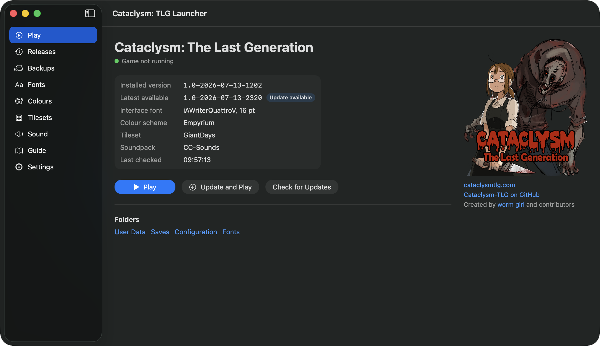

# Cataclysm: TLG Launcher

A native macOS launcher and update manager for
[Cataclysm: The Last Generation](https://github.com/Cataclysm-TLG/Cataclysm-TLG).



- Installs and updates TLG from GitHub releases (SHA-256 verified, atomic
  activation, previous version kept for rollback).
- Never touches the canonical TLG user directory during updates; takes a full
  backup of it before each one.
- First-class font picker for interface, map and overmap typefaces, with
  import into the persistent user font directory and live preview.
- Colour scheme picker for the preset palettes the game ships in
  data/raw/color_themes, with a live preview of each.
- Tileset picker for map, overmap and distant zoom, with sprite-sheet
  previews and folder install into the persistent user gfx directory.
- Sound pane: soundpack picker, volume sliders, and soundpack install into
  the persistent user sound directory.
- Bundles the TLG Hitchhiker's Guide, served to a WKWebView from a
  loopback-only HTTP server.
- Generates the guide's game data locally from the installed build (same
  format as RenechCDDA/tlg-data, verified equivalent), so the guide matches
  the version you play and works offline; falls back to the remote data
  otherwise.
- Backups and restore, with safety copies before every restore.
- Notifies when a newer launcher release is available (a banner linking to
  the release — no self-modifying auto-update).

See `Docs/ARCHITECTURE.md` for design.

## Installing

Download the DMG from
[Releases](https://github.com/jalexspringer/tlg-launcher/releases) and drag
Cataclysm TLG Launcher to Applications. The app is ad-hoc signed rather than
notarised, so macOS blocks the first launch. Once only:

- **macOS 15 or later**: open the app (it will be blocked), then go to
  System Settings → Privacy & Security, scroll to the message about the
  launcher, and click **Open Anyway**.
- **macOS 14**: right-click the app and choose Open.

Or from a terminal:
`xattr -d com.apple.quarantine "/Applications/Cataclysm TLG Launcher.app"`.

The launcher talks only to GitHub (release listings and downloads); there is
no telemetry.

## Building

Requires macOS 14+ and the Xcode Command Line Tools (Swift 6+). No Xcode needed.

```sh
swift build                      # compile
swift run TLGLauncherChecks      # run the check suite
Scripts/build-guide.sh [path]    # build the guide frontend and stage its dist/
Scripts/make-app.sh              # assemble the .app bundle (ad-hoc signed)
Scripts/make-dmg.sh              # package the app as a drag-to-install DMG
```

`swift run TLGLauncher` also works for development; the guide is picked up
from `GuideDist/` in the working directory.

The bundled guide is built from a checkout of the TLG Hitchhiker's Guide
frontend (`tlg-guide`), expected as a sibling directory or passed as the
argument to `build-guide.sh`. Without it, `make-app.sh --skip-guide` builds
the app with the Guide tab empty.

## Credits

Cataclysm: The Last Generation is created by
[worm girl](https://www.youtube.com/@worm-girl) and contributors —
[cataclysmtlg.com](https://cataclysmtlg.com/),
[Cataclysm-TLG on GitHub](https://github.com/Cataclysm-TLG/Cataclysm-TLG).
The artwork shown in the launcher is from the TLG project. This launcher is
an independent fan tool, not an official TLG release.

The bundled guide is a TLG adaptation of
[The Hitchhiker's Guide to the Cataclysm](https://github.com/nornagon/cdda-guide)
by nornagon (GPL-3.0; adapted source at
[jalexspringer/tlg-guide](https://github.com/jalexspringer/tlg-guide)), with
game data in the format of
[RenechCDDA/tlg-data](https://github.com/RenechCDDA/tlg-data).

## Licence

[CC BY-SA 4.0](LICENSE), matching the game's own CC-BY-SA licensing (the
repository redistributes TLG artwork, which stays under the game project's
terms and attribution). The guide staged into built apps remains GPL-3.0,
per its upstream.
